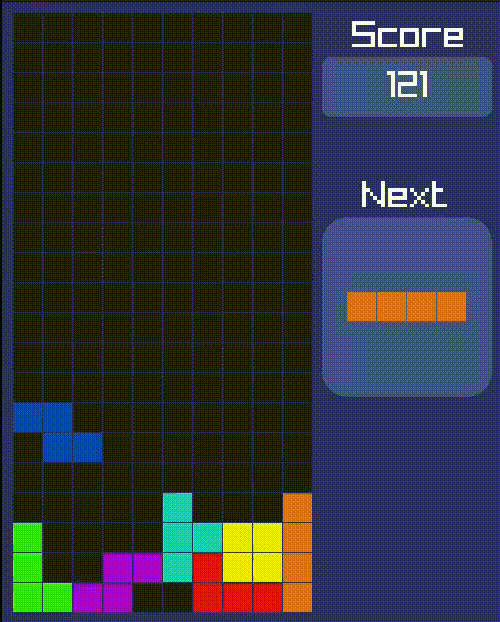

# 🕹️ Tetris Game 🧩🧱



### Overview of Classic Tetris 🎮

**Objective:**
- Clear as many horizontal lines as possible by fitting different shapes of blocks together without leaving gaps.

**Gameplay:**
1. **Playing Field:** 
   - A vertical grid, 10 cells wide and 20 cells high.
2. **Tetrominoes:** 
   - Seven shapes (I, O, T, S, Z, J, L) each consisting of four squares.
3. **Controls:** 
   - Move left/right, rotate, soft drop, hard drop.
4. **Line Clearing:** 
   - Clear filled lines, causing blocks above to move down.
5. **Scoring:** 
   - Points for lines cleared, with bonuses for multiple lines at once.
6. **Game Over:** 
   - Ends when tetrominoes stack to the top.

**Strategy:**
- Plan ahead 🧠
- Manage stack height 🏗️
- Clear lines efficiently ✔️

Classic Tetris combines strategic planning, quick reflexes, and spatial awareness, making it a timeless and engaging puzzle game. 🕹️

## ✨ Features
- Music and sound effects by 
- Next Block Preview
- Score Counter

## 🎮 Controls
- **Player:**
  - move right: `Right Arrow Key`
  - move left: `Left Arrow key`
  - rotate block: `Up Arrow Key`
  - go down: `Down Arrow key`

## 📋 Requirements

- C++ compiler (e.g., g++)
- Raylib library

## 💻 Installation

1. **Clone the Repository:**
    ```sh
    git clone https://github.com/g-magdy/tetris-game.git
    cd tetris-game
    ```

2. **Install Raylib:**
    Follow the instructions on the [Raylib website](https://www.raylib.com/) to install Raylib for your operating system.

3. **Compile the Game:**
    ```sh
    make game
    ```

4. **Run the Game:**
    ```sh
    ./game
    ```

## 📁 Code Structure

- **main.cpp:** Contains the main game loop and initialization code.
- **Constants.h**  Contains global configuration and constants 
- **Game class** Contains the game logic

## 🤝 Contributing

Currently, I am the only contributor to this project. However, if you have suggestions or improvements, feel free to fork the repository and create a pull request.

## 📄 License

This project is open source and available under the [MIT License](LICENSE).

Enjoy playing 🕹️ Tetris! 🧩🧱